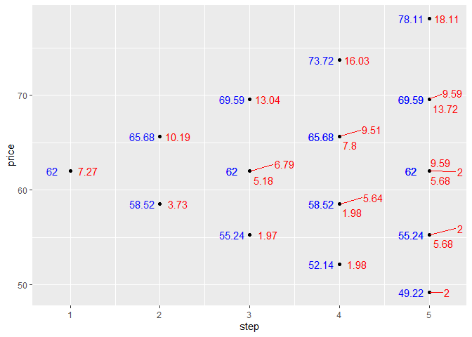

Option pricing in the binomial model
================


## Introduction

This package makes available a number of functions for pricing options
in the context of the binomial model, developed by Cox, Ross, and
Rubinstein (Cox, Ross, and Rubinstein 1979) and described in more detail
below. This model is attractive from a pedagogical angle because it
allows an instructor to exhibit the core ideas behind arbitrage pricing
in an intuitive environment. Moreover, it yields a pricing algorithm
that is simple to implement, and, in the limit, yields option values
which converge to those given by the more sophisticated Black-Scholes
model.

Included in this package are options for pricing common options. For
example, here is a vanilla European call:

``` r
# devtools::install_github("kinto-b/binomialpricing") # Uncomment to install
library(binomialpricing)

res <- crr_optionvalue(
  S0 = 62,
  u = 1.05943,
  d = 1/1.05943,
  r = 0.1/12, # 10% p.a compounded monthly
  expiry = 5,
  implicit_value = implicit_value(Sk=60, contract = "call"),
  american = FALSE
)
crr_plot(res)
```


You can use the `implicit_value()` function to pass through a range of
standard payoff functions, like a lookback payoff

``` r
res <- crr_optionvalue(
  S0 = 62,
  u = 1.05943,
  d = 1/1.05943,
  r = 0.1/12, # 10% p.a compounded monthly
  expiry = 4,
  implicit_value = implicit_value(Sk=60, contract = "call", exotic = "lookback_max"),
  american = FALSE
)
crr_plot(res)
```



Or a barrier payoff,

``` r
res <- crr_optionvalue(
  S0 = 62,
  u = 1.05943,
  d = 1/1.05943,
  r = 0.1/12, # 10% p.a compounded monthly
  expiry = 4,
  # ui denotes an up-and-in barrier
  implicit_value = implicit_value(Sk=60, contract = "call", barrier = "ui"), 
  american = FALSE
)
crr_plot(res)
```


But you can also roll your own payoff function to pass through. It just
needs to take in a matrix of prices, in which each column corresponds to
a time step and each row to a possible path through the lattice,

``` r
strangle_payoff <- function(prices) {
  pr <- prices[, ncol(prices)] # Latest price stored in last column
  
  vc <- pr - 65
  vp <- 55-pr
  v <- ifelse(vc<vp, vp, vc)
  v[v<0] <- 0
  
  v
}

res <- crr_optionvalue(
  S0 = 62,
  u = 1.05943,
  d = 1/1.05943,
  r = 0.1/12, # 10% p.a compounded monthly
  expiry = 5,
  implicit_value = strangle_payoff,
  american = FALSE
)
crr_plot(res)
```


## Background

### Notation

Our setting is the following. We have a stock process
$S = \{S_0, ..., S_T\}$, a bond process $B = \{B_0, ..., B_T\}$, a
portfolio process
$\phi = (\sigma, \beta) = \{(\sigma_0, \beta_0), ..., (\sigma_T, \beta_T)\}$,
a contingent claim $X = \{X_0, ..., X_T\}$, and a filtration
$\mathcal{F} = \{\mathcal{F}_0, ..., \mathcal{F}_T\}$.

The portfolio process gives us the number of stocks and bonds held at
each period so that the wealth process, $V$, at period $k \ge 1$ is
given by

$$
V_k(\phi) = \begin{cases}
  \sigma_0 S_0 + \beta_0 B_0 = 0        & k = 0     \\
  \sigma_{k-1} S_k + \beta_{k-1} B_k    & k \ge 0 
\end{cases}
$$

We assume that our portfolio is self-financing, i.e. that the purchases
we make at $k+1$ are exactly matched by the wealth we started with at
that time, or mathematically that
$\beta_k B_k + \sigma_k S_k = \beta_{k+1} B_k + \sigma_{k+1} S_k$

We call the triplet $\mathcal{M} = \{S, B, \Phi\}$, where $\Phi$ is the
space of portfolios, the *market* or *model*.

Our principal aim is to price options with expiration time $T$ in this
setting.

### Options

The main options we will deal with are European calls and puts and
American calls and puts.

<div id="def-european" class="theorem definition">

<span class="theorem-title">**Definition 1 **</span>A European call
(resp. put), $X$, on a given stock, $S$, gives its holder the right but
not the obligation to buy (resp. sell) that stock at maturity for an
agreed upon price, the strike price. The value of the call (resp. put)
at maturity is therefore $X_T = g_c(S_T) = (S_T - K)^{+}$ (resp.
$X_T = g_p(S_T) = (K - S_T)^{+}$).

</div>

Notice that the difference between the value of a European call and put
at maturity is

$$
g_c(S_T) - g_p(S_T) = S_T - K
$$

We will use this result below to establish put/call parity in the
context of the binomial model. See [Theorem 2](#thm-put_call_parity).

An American call (resp. put) is identical to a European call (resp. put)
except that it gives the holder the right to buy (resp. sell) the stock
at any time up to maturity.

<div id="def-implicit_price" class="theorem definition">

<span class="theorem-title">**Definition 2 **</span>The *implicit price*
of an American call (resp. put) at time $k$ is the amount the holder
would receive if they exercised it to buy (resp. sell) the underlying
stock at the strike price. It is given by $g(S_k) = (S_k - K)^{+}$
(resp. $g(S_k) = (K - S_T)^{+}$).

</div>

### Arbitrage pricing

A fundamental technique we will use is that of **replication**.

<div id="def-replicate" class="theorem definition">

<span class="theorem-title">**Definition 3 **</span>Portfolio $\phi$
*replicates* a contingent claim $X$ if $V_T(\phi) = X_T$ a.s.

</div>

<div id="def-manufacturing_cost" class="theorem definition">

<span class="theorem-title">**Definition 4 **</span>The initial price of
a portfolio $\phi$ which replicates contingent claim $X$ is the
*manufacturing cost*, $\pi_0(X)$ of that claim,
i.e. $\pi_0(X) = V_0(\phi)$.

</div>

Notice that if $X_0 \ne \pi_0(X)$, then there is a way to make a
risk-free profit. For example, suppose I start with no money and that
$X_0 < V_0(\phi)$, where $\phi$ replcates $X$. I can go short on the
portfolio by starting with $-\sigma_0$ stocks and $-\beta_0$ bonds.
Using the proceeds, I can then purchase $X$ for $X_0$ and have a little
bit left over, $\delta = V_0(\phi)-X$. After $T$ periods, my portfolio
is worth $-V_T(\phi)$ and my claim is worth $X_T$. Since the two are
equal, I can settle up. At the end I’m left with only the initial
difference $\delta$.

Clearly, it is not rational for the seller of $X$ to offer me this
trade. If they want to raise money, they would be better off adopting
the portfolio I selected in order to finance my purchase of $X$. That
way they start with $V_0(\phi) > X_0$ and they can settle up at $T$ like
I did.

It would seem, therefore, that the only rational price for $X$ should be
its manufacturing price. And indeed this is the case if the model
$\mathcal{M}$ is arbitrage-free.

<div id="def-arbitrage_free" class="theorem definition">

<span class="theorem-title">**Definition 5 **</span>A market
$\mathcal{M}$ is *arbitrage-free* if and only if
$\nexists \phi \in \Phi$ such that $V_0(\phi) = 0$ and $V_T(\phi) \ge 0$
a.s. and $\mathbb{P}(V_T(\phi) > 0) > 0$.

</div>

## The binomial model

In the binomial model, the price of the stock either goes up by a factor
$u$ or down by a factor $d$ at each time step,
i.e. $S_{k+1} = Z_{k+1}S_k$ where
$p = \mathbb{P}(Z_k = u) = 1-\mathbb{P}(Z_k = d)$, and bonds attract
simple interest so that $B_k = (1+r)^k = \hat r^k$. (Notice that in this
model the log-returns, $\rho_k = \ln S_k/S_{k-1}$ take the form of an
arithmetic random walk.)

### European options

#### One-step

To begin with, consider the special case in which $T=1$. Suppose that we
have an arbitrary *European* claim, $X$, paying $g(S_T)$ at expiration
so that $X_T = g(S_T)$. We know that the fair price for this claim will
be the manufacturing price, which is the cost of setting up a
replicating portfolio $\phi$. Recall that by definition
$V_T(\phi) = X_T$ a.s. In the context of our simple model this means
precisely that

$$
\begin{cases}
  \sigma_0 (u S_0) + \beta_0 \hat r = g(uS_0) \\
  \sigma_0 (d S_0) + \beta_0 \hat r = g(dS_0)
\end{cases}
$$

Solving this system of equations gives,

$$
\begin{cases}
  \sigma_0 = \frac{g(uS_0) - g(dS_0)}{(u-d)S_0} \\
  \beta_0 = \frac{ug(dS_0) - dg(uS_0)}{\hat r(u-d)}
\end{cases}
$$

If we define $\tilde p = \frac{\hat r - d}{u-d}$ and construct the
measure $\mathbb{\tilde P}$ s.t. $\mathbb{\tilde P}(Z_1 = u)= \tilde p$,
then substituting the solution above back into the value process we get
the following equation,

$$
\pi_0(X) = V_0(\phi) = \mathbb{\tilde E} (X_T / \hat r)  
$$

(Note that $\tilde p \in (0, 1)$ iff $d < \hat r < u$. We return to this
below.)

#### Multi-step

Now suppose that $T > 1$ and assume WLOG that our European claim has
payoff at maturity $g(S_1, ..., S_T)$. Let us consider what the price of
claim ought to be at time $T-1$. Given that at this point we know the
stock prices up to $T-1$, we are back in the setting of the one-step
model. The payoff is either $g(S_1, ..., uS_{T-1})$ or
$g(S_1, ..., dS_{T-1})$. Matching this to our portfolio value will give
us two equations in two unknowns, etc. etc. We know what the conclusion
will be, namely

$$
X_{T-1} = \mathbb{\tilde E} (X_T / \hat r | \mathcal{F}_{T-1})
$$

Moreover, at $T-2$ we may also consider ourselves in the setting of the
one-step model, but instead of looking for a portfolio $\phi$ where
$V_T(\phi) = X_T$ we look for a portfolio where
$V_{T-1}(\phi) = X_{T-1}$. Once again, we know the fair price:

$$
X_{T-2} = \mathbb{\tilde E} (X_{T-1} / \hat r | \mathcal{F}_{T-2})
  = \mathbb{\tilde E} (\mathbb{\tilde E} (X_T / \hat r | \mathcal{F}_{T-1}) / \hat r | \mathcal{F}_{T-2})
  = \mathbb{\tilde E} (X_T/ \hat r^{2} | \mathcal{F}_{T-2})
$$

Ultimately, we arrive at the result

$$
X_0 = \mathbb{\tilde E} (X_T/ \hat r^{T} | \mathcal{F}_{0}) = \mathbb{\tilde E} (X_T/ \hat r^{T})
$$

(We emphasise that this procedure allows us to replicate *any* arbitrary
European claim. We often express this by saying that any European claim
is *attainable* in the binomial model. Models with this property are
deemed *complete*.)

Or, more generally,

<div id="thm-european_valuation" class="theorem">

<span class="theorem-title">**Theorem 1 **</span>The value of a European
option at time $T-m$ is given by
$X_{T-m} = \mathbb{\tilde E} (X_T / \hat r^{m} | \mathcal{F}_{T-m})$.

</div>

In this manner, we can compute the prices, $\pi_0(X), ..., \pi_{T}(X)$,
as well as the replicating process, $\phi_0, ..., \phi_{T}$, along the
entire lattice.

(Actually for European calls/puts we do not need to use the recursive
procedure since a closed for solution exists, the so-called
‘Cox-Ross-Rubinstein valuation formula’.)

In closing, we observe that the value of a European call is exactly
equal to the value of a European put.

<div id="thm-put_call_parity" class="theorem">

<span class="theorem-title">**Theorem 2 (Put/call parity) **</span>Given
European call $C$ and put $P$ with strike price $K$, at any time $T-k$,
$C_{T-k} - P_{T-k} = S_{T-k} - K \hat r^{-k}$.

</div>

<div class="proof">

<span class="proof-title">*Proof*. </span>Notice that
$\mathbb{\tilde E}(S_T | F_{T-1}) = \tilde p uS_{T-1} + (1-\tilde p)dS_{T-1} = \hat r S_{T-1}$.
It is simple to extend this result to show
$\mathbb{\tilde E}(S_T | F_{T-k}) = \hat r^k S_{T-k}$. Consequently,

$$
C_{T-k} - P_{T-k} 
  = \hat r^{-k} \mathbb{\tilde E}(C_T - P_T | F_{T-k} ) 
  = \hat r^{-k} \mathbb{\tilde E}(S_T - K | F_{T-k} )
  = S_{T-k} - K \hat r^{-k}
$$

</div>

### American options

On the face of it, American options seem to be somewhat more complicated
than their European cousins. And, indeed, American puts *are* more
challenging to price than European puts. American calls, on the other
hand, are equivalent to European calls as the following theorem states,

<div id="thm-american_call_equivalence" class="theorem">

<span class="theorem-title">**Theorem 3 **</span>Given European call $C$
and American call $C^a$ with strike price $K$, at any time $T-k$,
$C_k = C^a_k$.

</div>

<div class="proof">

<span class="proof-title">*Proof*. </span>It is obvious that
$C^a_k \ge C_k$. We need only consider the possibility that
$C^a_k > C_k$. Suppose this is the case.

Since $g_c(x) = (x - K)^+$ is convex, by Jensen’s inequality we have

Hence, it is clear that if interest rates are non-negative, i.e. if
$\hat r \ge 1$, it follows that $C_{T-k} \ge ( S_{T-k} - K)^+$.

Now suppose that at time $k$ I sell the American call, buy the European
call, and park the difference $\delta = C^a_k - C_k$ in bonds. If the
buyer of the American call holds to maturity, I carry off
$\delta \hat r^{T-k}$ profit since what I make off the European call
balances what I lose on the American one; if she exercises early, I rake
in even more since I can sell my European call for more than the
$(S_{k+t} - K)^+$ I owe her. In other words, if $C^a_k > C_k$ there is
an arbitrage opportunity.

</div>

Notice that for an American put a similar set of inequalities can be
formulated,

$$
P_{T-k} 
  = \mathbb{\tilde E}(\hat r^{-k} g_p(S_T) | F_{T-k}) 
  \ge \hat r^{-k} g_p(\mathbb{\tilde E}( S_T | F_{T-k}))
  = \hat r^{-k} (K-\hat r^{k} S_{T-k})^+
  = (\hat r^{-k} K - S_{T-k})^+
$$

However, when $\hat r \ge 1$, it does not follow from this that
$P_{T-k} \ge (K- S_{T-k})^+$. (Though when $\hat r < 1$ the argument
proceeds as above). The upshot is that the price of an American put can
diverge from the price of a European put.

Conceptually, an American option in discrete time is just like a
contract which ties together $T$ European options, with expiry times
$1, 2, ..., T$, under the restriction that only one of them may be
exercised. Consequently, it’s price at any time should be the same as
the highest priced European option. In other words,

<div id="thm-american_valuation" class="theorem">

<span class="theorem-title">**Theorem 4 **</span>Let
$\mathcal{T}_m = \{\tau: \tau \text{ is a ST and } m \le \tau \le T\}$
be the class of all stopping times bounded by $m$ and $T$. The value of
an American put at time $m$ is given by

$$
X_{m} = \max_{\tau \in \mathcal{T}_m} \mathbb{\tilde E} (g_p(S_\tau) / \hat r^{\tau - m} | \mathcal{F}_{m})
$$

</div>

Now, it is obvious that
$X_m \ge \mathbb{\tilde E}(X_{m+1}|\mathcal{F}_{m})$. For the
right-hand-side is exactly the price the option *would* have *if* we
were unable to exercise at time $m$, which cannot but be lower than the
price of an option which offers the additional freedom of exercising at
time $m$. More formally, we have the result

<div id="thm-american_supermg" class="theorem">

<span class="theorem-title">**Theorem 5 **</span>The value of an
American put is a supermartingale

</div>

<div class="proof">

<span class="proof-title">*Proof*. </span>Let $\tau_m^*$ be the ST that
realises the maximum at time $m$. Then

$$
\mathbb{\tilde E}(X_{m+1}|\mathcal{F}_{m})
  \overset{(*)}{=} \mathbb{\tilde E}(g_p(S_{\tau_{m+1}^*}) / \hat r^{\tau_{m+1}^* - m - 1} |\mathcal{F}_{m})
  \overset{(**)}{\le} \mathbb{\tilde E}(g_p(S_{\tau_{m}^*}) / \hat r^{\tau_{m}^* - m} |\mathcal{F}_{m})
  = X_m
$$

where (\*) is due to the tower property and (\*\*) is because $\tau_m^*$
is the ST which maximises the value of
$\mathbb{\tilde E} (g_p(S_\tau) / \hat r^{\tau - m} | \mathcal{F}_{m})$.

</div>

Hence by the optional sampling theorem we end up with a squeeze,

$$
X_0 
  \ge \mathbb{\tilde E}(X_{\tau^*}) 
  \ge \mathbb{\tilde E}(g_p(S_{\tau^*}) / \hat r^{\tau^*})
  = X_0
$$

Since $X_m \ge g_p(S_{m}) / \hat r^{m}$ for all $m$, the upshot is that
$X_{\tau^*} = g_p(S_{\tau^*}) / \hat r^{\tau^*}$ a.s. This result allows
us to establish,

<div id="thm-american_optimal_stop" class="theorem">

<span class="theorem-title">**Theorem 6 **</span>Given an American put,
the optimal exercise time is given by
$\tau^* = \inf \{k: X_k = g_p(S_k) / \hat r^{k}\}$

</div>

<div class="proof">

<span class="proof-title">*Proof*. </span>We know that if $\tau'$ is a
maximising ST, then $X_{\tau'} = g_p(S_{\tau'}) / \hat r^{\tau'}$. Hence
it follows that $\tau^* \le \tau'$. Thus, by optional sampling theorem,

$$
g_p(S_{\tau^*}) / \hat r^{\tau^*} 
  = X_{\tau^*} 
  \ge \mathbb{\tilde E}(X_{\tau'}|\mathcal{F}_{\tau^*})  
  = \mathbb{\tilde E}( g_p(S_{\tau'}) / \hat r^{\tau'} |\mathcal{F}_{\tau^*})
$$

Taking expectations of both sides then we get

$$
\mathbb{\tilde E}( g_p(S_{\tau^*}) / \hat r^{\tau^*})
 \ge \mathbb{\tilde E}( g_p(S_{\tau'}) / \hat r^{\tau'})
$$

Hence $\tau^*$ must be the maximising ST.

</div>

## References

<div id="refs" class="references csl-bib-body hanging-indent">

<div id="ref-cox_1979" class="csl-entry">

Cox, John C., Stephen A. Ross, and Mark Rubinstein. 1979. “Option
Pricing: A Simplified Approach.” *Journal of Financial Economics* 7 (3):
229–63. <https://doi.org/10.1016/0304-405X(79)90015-1>.

</div>

</div>
